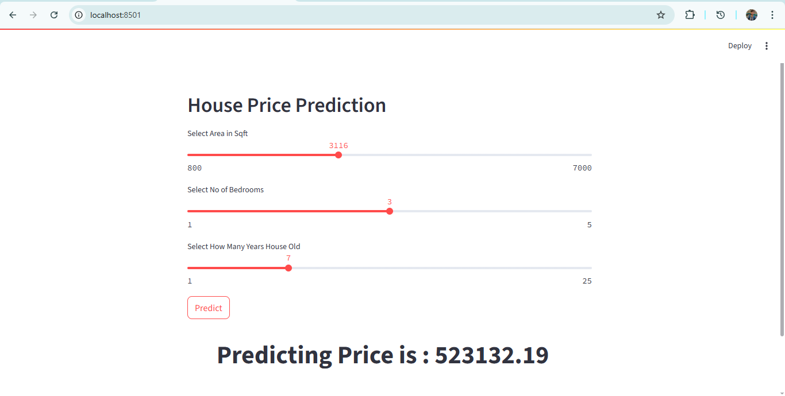

House Price Prediction
📌 Algorithm: Linear Regression
🖼️ Image: 

📖 Description

This project predicts house prices based on multiple features such as:

House size (sqft)

Number of bedrooms

Age of the house

A Linear Regression model is trained on historical housing data and deployed using Streamlit for real-time predictions.

🔧 Technologies Used

Python

Pandas

NumPy

Scikit-Learn

Streamlit

Matplotlib

🎯 Features

Multiple Linear Regression

Interactive Streamlit UI

Real-time house price prediction

User-friendly frontend
